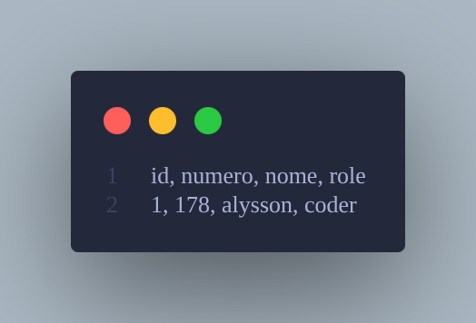

# CSV to XLSX or Else

Bem-vindo à ferramenta **csv-to-xlsx-or-else**!

Com esta ferramenta, você pode:
- Converter arquivos CSV para Excel (`.xlsx`)
- Converter arquivos Excel (`.xlsx`) para CSV

---

# O que é CSV?

CSV é um formato de arquivo de texto simples usado para armazenar dados tabulares, como planilhas ou bancos de dados.

Cada linha representa um registro, e os campos são separados por vírgulas (ou outros delimitadores).

O formato CSV é amplamente utilizado para importar e exportar dados entre diferentes aplicações.

## Exemplo de CSV



---

# O que é XLSX?

XLSX é o formato de planilhas do Microsoft Excel.

Ele suporta:
- fórmulas
- gráficos
- formatação avançada
- múltiplas planilhas

É o formato padrão do Excel desde 2007.

---

# Como usar

## 1. Instale o Python

Baixe o Python no site oficial.

## 2. Instale o pandas

```bash
pip install pandas
```

## 3. Execute o programa

```bash
python main.py
```

## 4. Siga as instruções

Escolha:
- o tipo do arquivo
- o caminho do arquivo
- se deseja converter ou apenas visualizar os dados

---

# Resultado

O programa criará:
- `Dados_em_Csv.csv`
ou
- `Dados_em_excel.xlsx`

dependendo da conversão escolhida.